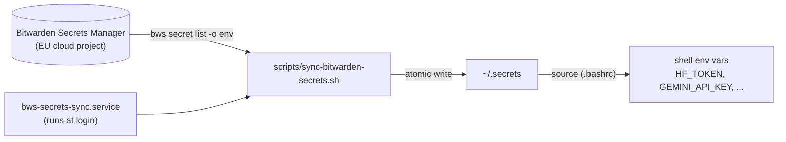

# OS Setup Dotfiles

For personal use. Stateless, declarative, cross-distro provisioning with automatic version control.

## Usage

Single command bootstraps entire system: installs prerequisites, provisions packages, deploys dotfiles.

```bash
./setup.sh
```

## Key Benefits

- ✅ **Reproducible Environments** - Fresh machine becomes ready in a single command.
- ✅ **Automatic Updates** - No static binary rot. brew/flaptpak update all software (CLI/GUI) in one command.
- ✅ **Cross-Distro Compatibility** - Same setup works on any Linux distribution.
- ✅ **Declarative Configuration** - System state defined in code, not manual commands.
- ✅ **Idempotent Provisioning** - Safe to re-run. Already-installed packages skip automatically.
- ✅ **Rollback Capability** - Package managers track installations. Uninstall cleanly if needed.
- ✅ **Dependency Management** - Homebrew/Flatpak handle transitive dependencies automatically.
- ✅ **Secrets Management** - Bitwarden Secrets Manager syncs API keys/tokens across every machine.

## Stack

- **Ansible** — declarative package management (apt/pacman/dnf autodetected via `package` module)
- **Homebrew** — CLI tools with `brew upgrade` for updates, identical versions cross-distro
- **Flatpak** — sandboxed GUI apps, distro-agnostic
- **Chezmoi** — dotfile templating (maps `dot_` to `.`)
- **Bitwarden Secrets Manager** — cross-device secret sync (see below)

## Design

- **CLI via Homebrew** — avoids `curl | bash` static binary rot; `brew upgrade` handles all updates
- **GUI via Flatpak** — sandboxed, dependency-free, works on immutable distros
- **Core tools via system pkg manager** — git, tmux, htop, kitty stay native
- **Fonts via Homebrew Casks** — user-space install to `~/.local/share/fonts`

All tasks are idempotent — safe to re-run. Same playbook works on Arch, Debian, Fedora, Ubuntu without modification.

## Secrets

`~/.secrets` (sourced by `.bashrc`) is a local cache regenerated from a shared Bitwarden Secrets Manager project — never hand-edited, never committed.



- **New machine:** `./setup-bitwarden.sh` — installs `bw`/`bws`/Bitwarden Desktop, sets the EU region, prompts once for the machine account's access token, resolves the project, and does the first sync.
- **Add a new secret:** create it in the Bitwarden web vault (or `bws secret create KEY VALUE <project-id>`), then run `secrets-sync` on each machine (or wait for its next login) to pull it down.
- **Force a refresh now:** `secrets-sync` alias.

## Customization

Add `dot_bashrc_appendix` to chezmoi directory, then `chezmoi apply`.
